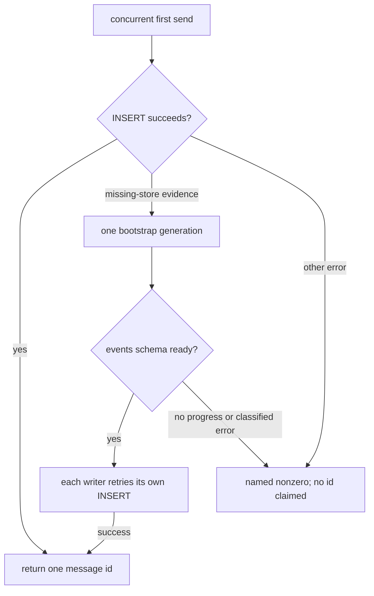
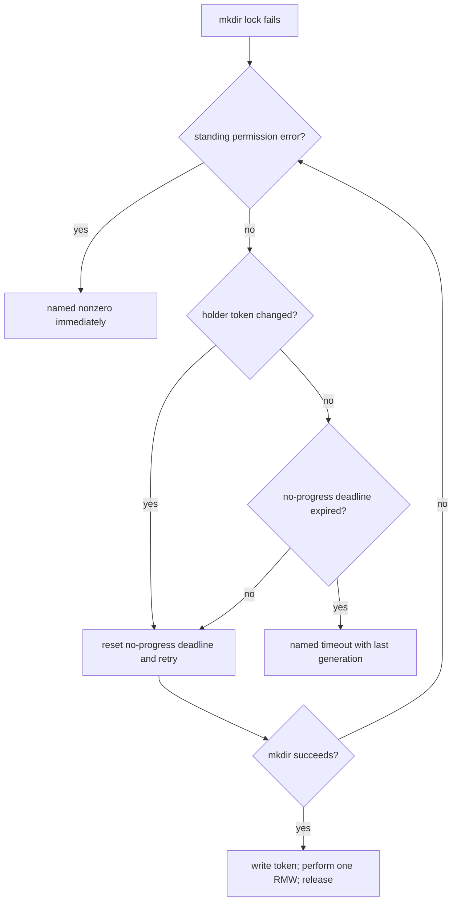

# R5-P8/P9: 初回アクセス並行 fan-out の診断と進捗契約

## 結論

P8（#181）とP9（#189）は、固定回数または固定**全体**budgetが、初回アクセス時の同時実行数と負荷を織り込まないR5の同一亜型である。ただしresource、成功predicate、失敗時の安全策は異なる。

| 実装PR | 1つの主張 | 範囲 |
| --- | --- | --- |
| A: 診断 | P8/P9のfan-out testが、件数差ではなく各childのexit/stderrと実件数をfailure packetとして出す | `tests/test_storage.bats`、`tests/test_team.bats`、P8の最終sqlite retry stderr |
| B: P8修復 | fresh SQLite storeはbootstrapを一世代だけ行い、同時writerはready predicate後にinsertする | sqlite storage driverとP8 focused test |
| C: P9修復 | registry writerは他writer generationが進む間、queue全体の経過時間だけではtimeoutしない | `registry-lock.sh`、P9 focused test、影響するlock contract test |

従って「診断と修正」の二段階は維持するが、修正を1 PRへ混ぜない。P8のSQLite bootstrapとP9のregistry-lock進捗は別ABIであり、別々に受入可能だからである。A → B → C の順で実装する。診断Aは共通の**観測主張**なので1 PRにまとめる。

これはR5-T1/P3の「回数を実時間deadlineへ直す」設計を再利用しない。P9は既に`AGMSG_LOCK_SECONDS=10`の実時間budgetを持つ。それを長くするだけでは、N本の正当なwriterが直列化される場合に再発する。

## 証跡と訂正

| 項目 | value | source / command | 限界 |
| --- | --- | --- | --- |
| P8頻度 | 直近80 runで4件、いずれもmain。Issue記録上は約5% | [#181](https://github.com/kappaseijin/agmsg/issues/181) | 今回のfocused runはgreenであり、低頻度を否定しない |
| P8 local control | `tests/test_storage.bats` のfresh-store testは`1..1 / ok 1` | `rtk bats -f 'concurrent fan-out to a FRESH' tests/test_storage.bats` | success runは機序の正対照だけで、修復根拠ではない |
| P9 local reproduction | `rc=1`、test line 159の最初の`wait`でfailure | `rtk bats -f 'concurrent joins to the same team' tests/test_team.bats` | 現行testはchild stderr/statusを捨てるのでtimeout原因は未観測 |
| P9 current code | `join.sh` はlock取得failureを`exit 1`にし、RMWはlock内 | `scripts/join.sh:116-300`、`scripts/lib/registry-lock.sh:56-107` | timeout機序（各critical sectionが遅い）はまだ読み |

両Issueの「静かに消えた」は撤回する。P8は`storage_send`が空を返すと`send.sh`がnonzero、P9は`agmsg_lock_acquire`のnonzeroを`join.sh`が伝播する。CI上で理由が消えたのは、両testがchildのstdout/stderrを`/dev/null`へ捨て、`wait` statusを検査しないR2型の欠落である。

## 共通診断PR A

### failure packet契約

各childには`$BATS_TEST_TMPDIR`配下の一意なstdout、stderr、exit-status artifactを割り当てる。fixture / store / team configの削除対象内には置かない。親は全childを必ずwaitし、successなら従来どおりquiet、失敗時だけ次をstderrへ出してnonzeroにする。

| field | P8 | P9 |
| --- | --- | --- |
| fan-out | expected/actual event count、eventの`seq/id/to_agent` | expected/actual agent count、missing agent id |
| child result | index、PID、wait exit、stdout/stderr | index、PID、wait exit、stdout/stderr |
| resource state | DB存在、schema/event rows。本文・秘密値は出さない | config存在、`.config.lock`の存在、holder tokenが読める時だけtoken |
| final cause | sqliteの最終retry stderr | `timed out acquiring registry lock`か、それ以外のstderr |

P8では`storage_send`の**二回目**のINSERTだけの`2>/dev/null`を外し、nonzeroになる時だけSQLiteの生stderrを呼出側へ渡す。最初の「table無し」probeを成功sendで表示しない。P9のproduction lockはすでにtimeout stderrを出すため、Aでretry/budget/lock policyを変えない。

### 対照

| 観点 | 正の対照 | KILLED / 負の対照 |
| --- | --- | --- |
| child result | injected P8/P9 child failureで、そのindex・exit・stderrとactual countがpacketに出る | captureを`/dev/null`へ戻すmutationではdiagnostic assertionがredになる |
| P8 sqlite cause | retry failure stubのSQLite stderrがpacketに出る | first INSERTのprobe stderrを通常成功へ漏らすmutationはquiet-success assertionがredになる |
| P9 timeout | held lockのshort budgetでtimeout stderrとmissing agentが出る | foreign/permission errorはcontention timeoutと表示せず、既存permission testを維持する |
| normal fan-out | initialized/fresh storeと12 joinの成功時はartifact headerなし | one childのnonzeroを無視する`wait` mutationはfailure assertionがredになる |

このPRは本番の`~/.agents/skills/agmsg/`を触らず、store/teamは既存`setup_test_env`のisolated rootで作る。

## 修復PR B: P8 fresh SQLite bootstrap

P8の成功predicateは「fresh storeへの有限N本のvalid sendが、各々一意のmessage idを返し、N件の`message_sent` eventを残す」である。`N × busy_timeout`へ延ばすこと、固定retry回数を増やすこと、失敗をsuccessへ畳むことは解決にしない。

実装はAのpacketでfinal retryがfresh bootstrap contentionだと裏取りできた時だけ進める。そうなら、schema creation/WAL transitionをN個のwriterが反復しないbootstrap coordinatorを導入する。leader以外はschemaの**ready predicate**（`events` tableをreadできること）を待ち、ready後に自身のINSERTを実行する。したがって負荷は「N回の重い初期化」ではなく「1回の初期化 + N個の通常insert」になる。

coordinatorは観測不能なfixed retryでleaderを奪わない。bootstrap generation/readyの変化を記録し、permission・malformed schemaは即時named failure、進捗不能はnamed unavailableとしてfail-closedにする。leader crashのautomatic stale reclaimを推測で入れない。Nが既知でないproduction APIにN比例のtimeoutを埋め込むこともしない。既存の「初期化済みstoreへの10並行send」green testは、bootstrapを通らない負の対照として残す。

P8 packetが`database is locked`以外を示す場合は、このcoordinator PRを作らない。packetの原因へ限定した新Issueを起こし、#181へそのURLを記録する。

## 修復PR C: P9 registry lockの進捗契約

P9の成功predicateは「有限N本のvalid joinが、前のwriter generationが完了し続ける限り、queueの先頭から順にlockを取得してN+1 agentを残す」である。failure predicateは「holder generationが進まない、又はpermission等のstanding error」であり、fan-out開始からの総経過10秒ではない。

`registry-lock.sh`はすでにlock取得直後にunique tokenとholder recordをbest-effortで書く。Cではそれを**進捗観測**に限定して使う。待機者は前回確認したholder tokenと異なるgenerationを観測したときだけno-progress deadlineをresetする。token無し/読取失敗はprogressとは扱わず、stale lockをreclaimしない。既定の`AGMSG_LOCK_TRIES=1000`はproductionの失敗条件から外し、testが明示指定する短いattempt controlとしてだけ残す。

これは無限到着のfairnessを保証するqueue schedulerではない。保証するのは、観測可能なholder generationが前進している有限fan-outを「開始からの一律10秒」で拒否しないことだけである。tokenが変わらないlock、tokenが読めないlock、permission errorは従来どおりfail-closedであり、既存のdoctor/manual recovery契約を壊さない。

P9 focused testは、各lock holderを制御された可視barrierで順に遅らせ、全体で10秒を超えてもgenerationが進むため全joinが成功することを測る。held lockをreleaseしない正対照はno-progress deadlineでnonzero、old global elapsed budgetへのmutationは前者をredにする。`sleep`はholder fixtureの寿命ではなく、token/ready barrierの観測で置換する。

## 初回アクセス fan-out 走査

「未初期化resourceへ複数processが初回アクセスする」観点で`storage_init`、`storage_send`、`agmsg_lock_acquire`の全call siteを走査した。下表は**列挙**であり、P8/P9以外を修復対象へ昇格しない。

| resource / path | fan-out と固定契約 | 判定 |
| --- | --- | --- |
| SQLite: `send.sh → storage_send` | fresh DBではP8。INSERT失敗→init→retry 1回、busy timeout 5s | **P8**。診断後にB |
| SQLite: `api.sh`、`message-status.sh`、`check-inbox.sh`、`claims.sh` | read/claimがlazy `storage_init`を呼べる。今回同時first-accessのpacket・fan-out testなし | candidate記録のみ |
| SQLite: `sqlite-sync.sh` / `storage-sync-driver.sh` | sync page/prepareがinitを呼ぶ。既にbusy outcomeを区別する別contract | candidate記録のみ。P8へ混ぜない |
| Registry: `join.sh` | new teamの12並行RMW。lock全体budget10s + default1000 attempts | **P9**。診断後にC |
| Registry: `leave/reset/rename/rename-team/roster-normalize` | same-team writerだが通常は既存team操作。今回初回fan-outのpacketなし | writer inventoryのみ |
| Registry: `key.sh`、`remote.sh`、migration/roster-sync drivers | key epoch・remote config・migrationは別のprecondition/lock orderingを持つ | candidate記録のみ。P9のlock ABI変更時にfocused regressionsを実行 |

`storage_init`を呼ぶこと自体はR5ではない。初期化済みstoreの10並行sendは現行focused testでgreenであり、P8の正の対照である。同様にregistry writer全体をtimeout無しへ変えることはしない。観測済み症状がないcandidateはIssueを増やさず、Aのfailure packetが同型を示した時だけ個別に起票する。

## Lane と除外

Lane Aの実装順は **#169B → R5-T1 → R5-P3 → A診断 → B P8 → C P9 → R5-T2〜T5** とする。AはR5-T1後のHEADへrebaseするが、P8/P9のproduction修復は互いに別PRである。

含めないものは、global busy timeoutの一律延長、registry lockのstale reclaim、call-site全体の自動retry、SQLite以外のdriver contract変更、production skill directory、R5台帳の既存項目の再分類である。

## 限界

P8の最終SQLite errorとP9の実際のholder timelineは、Aが入るまで未確認である。今回のP9 local `rc=1`はtestの観測欠落を再現しただけで、10秒timeoutを直接証明しない。よってB/Cはこの設計のpredicate・fail-closed境界を持つが、Aのpacketと一致しない原因へ実装を適用しない。
