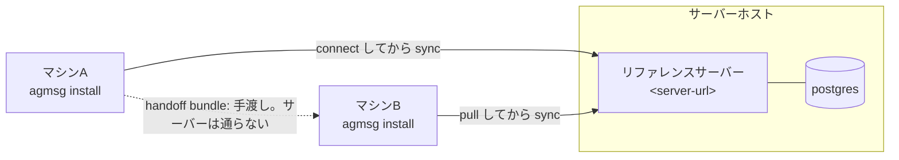

# リモートセットアップ

*[English](remote-setup.md)*

この手順書は、マシンAにある既存のチームをリファレンスサーバーに接続し、それを
マシンBの通常のagmsgインストールに取り込むまでを通す。クライアントコマンドは
手元のエージェントが実行する。ここでは平文同期を使う。暗号化された同期については
[追補: エンドツーエンド暗号化](#追補-エンドツーエンド暗号化)を読むこと。

## これから何をするか

| どこで | 何を |
|---|---|
| **サーバーホスト** | リファレンスサーバーを起動する — step 1 |
| **マシンA** | すでに持っているチームを接続する — step 2 |
| **マシンB** | agmsgをインストールし、チームをpullし、参加する — step 3 と 4 |
| **終わりの条件** | 片方で送ったメッセージが、もう片方に届く — step 5 |

同期のために2台が直接つながっている必要はない。どちらも同じサーバーURLに到達
すればよい。**共有するネットワーク上の宛先はそのURLだけ**だ。暗号化する場合は
それとは別に、鍵のbundleとそのdigestを、この接続の外で —— サーバーを通さずに ——
手渡しし、照合する。



点線は暗号化する場合だけの経路で、点線なのには理由がある。鍵のbundleを2台の間で
運ぶのは自分だ。これがサーバーを通ってしまうと、サーバーがメッセージを読めてしまう。

## 必要なもの

- Docker と Compose — 自前のデータベースを使うなら PostgreSQL 17。
  Compose の経路を使うなら、始める前に確認しておくこと:
  `docker compose version` を打ってバージョンが出ればよい。今回の報告環境
  では、Compose プラグインが無いと `docker compose up -d --build` が
  `unknown shorthand flag: 'd' in -d` で失敗し、そのエラー文には
  「compose」の一言も出てこなかった。あとで原因を探すより、先に確認した
  ほうが早い。
- Node.js 22 以降
- Bash、SQLite、curl
- サーバーホスト上の agmsg チェックアウト
- 両方のマシンから到達できるサーバーURL

サーバーがlocalhost以外にある場合はHTTPSを使うこと。

## 1. リファレンスサーバーを起動する

ComposeスタックはPostgreSQLとサーバーをまとめて立ち上げる。`server` ディレクトリ
から実行する:

```sh
cd server
docker compose up -d --build
```

埋める値はない。データベース名、ユーザー、パスワードは `server/compose.yaml` に
入っている。これらは開発用のデフォルトであり、このサーバーが自分以外から到達
できるようになる前に[ネットワーク境界](#ネットワーク境界)を読むこと。

サーバーとデータベースが準備できたことを確認する。Composeを動かしているマシンで:

```sh
curl -fsS http://127.0.0.1:8787/v1/health
```

レスポンスに `"status":"ok"` と `"database":"ok"` が含まれていればよい。コンテナが
まだ起動中なら、成功するまで再試行する。

**このアドレスが、以降のすべてのコマンドで使うエンドポイントだ。**両方のマシンから
到達できる限り、この文書が `<server-url>` と書いている場所には
`http://127.0.0.1:8787` を書けばよい。1台のホスト上の2アカウントなら到達できるし、
自分が管理するネットワーク上の2台なら `127.0.0.1` の代わりにホストのアドレスを使う。

2台目が**自分の管理外のネットワーク越し**に到達する場合だけ、公開されたHTTPSのURLが
要る。そのときはそちらからも確認する:

```sh
curl -fsS https://<server-url>/v1/health
```

このサーバーは自分が管理するネットワークに置くものだ。認証がなく、到達できること
がそのまま権限になる。自分以外から到達できるようにする前に
[ネットワーク境界](#ネットワーク境界)を読むこと。

すでにPostgreSQLを動かしているなら[自前のデータベースを使う場合](#自前のデータベースを使う場合)を参照。

## 2. マシンAで既存チームを接続する

マシンAでいつものローカルエージェントを開き、こう頼む:

> 既存の agmsg チーム `<team>` を `https://<server-url>` に接続して。

エージェントがローカルチームを接続し、結果を報告する。最後に、サーバーURLと
チーム名を埋めた `remote.sh pull` コマンドをコピー&ペーストできる形で出す。

接続すると、このチームは共有データベースからチーム単位のストアに移る。外部の
ツールがデータベースファイルを直接読んでいる場合は、共有データベースのパスを
使い続けずに、チームの新しいパスを解決すること。エージェントにストアのパスを
聞くか、[リファレンス](#リファレンス)のコマンドを使う。

**`--e2ee` で接続したなら、ハンドオフバンドルをここで書き出す。**鍵を持っている
マシンに、まだ居るうちに:

```sh
bash ~/.agents/skills/agmsg/scripts/key.sh handoff <team> --out <bundle-file>
```

スナップショットのダイジェストが表示される。**控えておくこと** ——
マシンBにはバンドルとは別の経路で渡す必要があり、**その2つを突き合わせるのが検査**だ。

**後回しにせず、ここでやる。**マシンBの `pull` は「チームはロックされている、
**渡されたバンドル**でアンロックしろ」と、既に在る前提で言ってくる。
**どちらのマシンも「作れ」とは言わない。**バンドルが何で、どう運ぶかは
[追補: エンドツーエンド暗号化](#追補-エンドツーエンド暗号化)にある。

## 3. マシンBでインストールしてpullする

マシンBに通常どおりagmsgをインストールする。いつものローカルエージェントを開き、
こう頼む:

> `https://<server-url>` にある既存の agmsg チーム `<team>` を取り込んで。

エージェントは remote pull を使って、サーバーにすでに存在するチームをインポート
する。同名のローカルチームを作ったり、そこに参加したりしてはいけない。同名の
未接続ローカルチームを見つけた場合は、上書きも統合もせずに停止して、どうするか
を尋ねる。

pullが成功すると、チームはマシンBに存在する。ただしそれは、マシンBがそのチーム
の一員になったこととは違う。チームはマシンAのロスターを持って到着しており、
こちら側のエージェントはまだそのチームでの名前を持っていない。もう1ステップ
必要で、それが次だ。

このチームが暗号化されている場合、`pull` はそこで止まり、チームがロックされて
いると報告する。[追補: エンドツーエンド暗号化](#追補-エンドツーエンド暗号化)に
進んでロックを解除し、ここに戻ってくること。

## 4. マシンBから参加する

チームに入れたいエージェントの中で、そのインストール自身のコマンドを**引数なし
で**呼ぶ:

```text
/agmsg
```

`npx agmsg` は `agmsg` という名前で入るので、打つのは `/agmsg` だ。コマンド名は
インストールに従うので、`install.sh` に自分で `--cmd` を渡したならその名前を使う
——[テスト用に別インストールを使う](#テスト用に別インストールを使う)を参照。

引数なしで呼ぶと、コマンドはこのエージェントがまだどのチームにも属していないこと
に気づき、見えているチームを一覧する。pullしたチームもその中にある。それを選ぶ。
チームはすでに存在するので、ロスターを読み、マシンAが使っている名前を把握した
うえで、同じ命名規則に沿った未使用の名前を提案する。続けて[配信モード](../README.ja.md#配信モード)を尋ねてくる。

**新しい名前を取ること。** 名前は1つのチームにおける1つのアイデンティティであり、
2台のマシンが同じ名前に応答する状態こそ、このステップが防ぐためにある。提案は
その場のロスターに対して生成されるので、どれを選んでも衝突しない。

ここにリモート固有のものは何もない。通常の初回参加そのものであり、これが終われば
チームは他のローカルチームと同じように動く。

## 5. 送信して確認する

マシンAで、ローカルエージェントに頼む:

> チーム `<team>` で `<from>` から `<to>` に `hello from machine A` を送って。

connectとpullが同期エンジンをすでに起動している。数秒待ってから、マシンBで
[historyコマンド](#クライアントコマンド-送信と確認)を使う。

履歴にこれが含まれているはずだ:

```text
<from> → <to>: hello from machine A
```

## 追補: エンドツーエンド暗号化

リモートチームの暗号化の選択は最初のconnectで固定され、後から変更できない。
暗号化されたチームが必要なら、`--e2ee` を付けて接続する:

```sh
bash ~/.agents/skills/agmsg/scripts/remote.sh connect \
  --endpoint https://<server-url> \
  --e2ee \
  <team>
```

チームにまだ鍵がなければ、connectが鍵を作り、必須のバックアップ通知を表示する。
マシンAで、確認済みのスナップショットチェーンと全エポックの識別情報を含む、
秘密の受け渡しバンドルを1つエクスポートする:

```sh
bash ~/.agents/skills/agmsg/scripts/key.sh handoff <team> --out <bundle-file>
```

そのバンドルは、別の信頼できる経路でマシンBに渡すこと。メッセージサーバーは鍵
そのものを配布しない。表示されたスナップショットのダイジェストは、別のライブな
チャネルで突き合わせる。`pull` がチームはロックされていると報告したあと、
マシンBで実行する:

```sh
bash ~/.agents/skills/agmsg/scripts/remote.sh unlock <team> \
  --bundle <bundle-file> \
  --confirm-digest <verified-sha256>
```

`unlock` は識別情報をインポートし、トラストアンカーを記録し、隔離されていた封筒
を再処理し、暗号化された同期エンジンを起動する。同じ確認済みバンドルで繰り返し
実行しても安全だ。バンドルには秘密鍵が入っている。秘密にしておき、渡したコピーは
不要になった時点で削除すること。

unlockが終わらせるのは鍵の作業であって、参加ではない。マシンBはまだチームでの
名前を持っていないので、[4. マシンBから参加する](#4-マシンbから参加する)に戻って
そこから続けること。

### チームの暗号化状態を確認する

ローカルでの見え方はどちらでも同じだ —— `history`、`inbox`、`send` は
チームが暗号化されているかどうかに関わらず、まったく同じように読み書きする。
**ローカルのメッセージ履歴が読めることは、そのチームが暗号化されていない証拠には
ならない。** 違うのはサーバー側だけだ。暗号化されたチームのサーバー側の行は
`cipher: age-v1` を持ち、封をされた暗号文を保持している。そのため `from`、`to`、
`body` はサーバー側では読めない。

あるチームがe2eeかどうかを知りたければ、読めるものから推測せず、プログラムに
聞くこと:

```sh
bash ~/.agents/skills/agmsg/scripts/remote.sh status <team>
```

接続済みのチームであれば、出力にはそのバインディングの宣言された暗号方式、
サーバーの書き込みポリシー、ローカル鍵の有無を反映した `encryption:` の行が
含まれる —— 取り得る値には `age-v1, ...`、`none`(2種類ある)、
`required, no local key` などがある。暗号化されている・いないの2択だと
決めつけず、その行自体を読むこと。切断済みのチームには `encryption:` の行
自体が無い。まず再接続すること。

## リファレンス

### ネットワーク境界

リファレンスプロファイルには認証がない。サーバーに到達できることがそのまま権限
になる。到達できてチーム名を知っている者は、そのチームのリモートストリームを
読める。自分が管理するネットワークに置き、localhostを出るものにはHTTPSを使う
こと。`age-v1` による暗号化（[前述](#追補-エンドツーエンド暗号化)）は封筒の中身を
サーバーから隠すが、この境界の代わりにはならない。

Composeスタックはポートを公開し、`compose.yaml` に開発用パスワードを同梱して
いる。自分の管理下にないネットワークに出す前に、そのパスワードを変更し、サービス
の手前でTLSを終端すること — [`server/README.md` → Compose
configuration](../server/README.md#compose-configuration) を参照。

### プライベートCAでTLSを終端する場合

手前のリバースプロキシの証明書が公開CA発行でない場合（自己署名や自前CA）、
`remote.sh` を呼ぶすべてのコマンドに `CURL_CA_BUNDLE=<ca.pemのパス>` を渡す
こと。`connect` 自体の通信はcurl経由でこの変数をそのまま読む。常駐する同期
エンジン・`pull`のチーム解決・pull自体のメッセージページ取得は全てNode
プロセスで、`remote-sync.sh`経由で起動される — `NODE_EXTRA_CA_CERTS`が
未設定なら、同じ`CURL_CA_BUNDLE`の値をそちらにも渡す。`CURL_CA_BUNDLE`を
設定すればこれら全てに効き、curlと異なる信頼をNodeに持たせたい場合だけ
`NODE_EXTRA_CA_CERTS`を別途指定する。

これはコマンド呼び出しごとの挙動で、チームのremote bindingには記憶され
ない。エンジンがクラッシュしたり再起動した後の`remote.sh sync start <team>`
も含め、`remote.sh`を実行するシェルには毎回`CURL_CA_BUNDLE`が設定されて
いる必要がある（最初の`connect`を実行したシェルだけでは足りない）。

### 自前のデータベースを使う場合

すでにPostgreSQLを動かしているなら、それに対してソースからサーバーを起動する。
コマンドは [`server/README.md` → Run from
source](../server/README.md#run-from-source) にあり、書かれているのはそこ一箇所
だけだ。

どちらの方法でもサーバーは起動時に自分でマイグレーションを適用するので、先に
スキーマを作る手順はない。

### マシンBにインストールする

標準のインストール入口を使う:

```sh
npx agmsg
```

### マシンAを接続する

```sh
bash ~/.agents/skills/agmsg/scripts/remote.sh connect \
  --endpoint https://<server-url> \
  <team>
```

### チームストアを解決する

```sh
bash ~/.agents/skills/agmsg/scripts/api.sh get teams <team> store
```

### マシンBでpullする

```sh
bash ~/.agents/skills/agmsg/scripts/remote.sh pull \
  --endpoint https://<server-url> \
  <team>
```

### クライアントコマンド: 送信と確認

```sh
bash ~/.agents/skills/agmsg/scripts/send.sh \
  <team> <from> <to> "hello from machine A"

bash ~/.agents/skills/agmsg/scripts/history.sh <team> <to>
```

### テスト用に別インストールを使う

既存のインストールとテストを分けたい場合は、リポジトリをクローンして、チェック
アウトのルートでこれを実行する:

```sh
bash install.sh --cmd agmsg-test
```

そのインストールのコマンドは `~/.agents/skills/agmsg-test/scripts/` の下にある。

1台のマシンで2つのインストールを使うリハーサルについては
[Try it on one machine](design/remote-sync.md#try-it-on-one-machine) を参照。

**環境変数ではなく、インストールを分けること。** `AGMSG_SYNC_CONNECTION_DIR`、
`AGMSG_STORAGE_PATH` などを1つのインストールに向けて2台目のマシンを模倣したく
なる。しかしそれは見た目より分離しておらず、分離しきれていない部分は静かに壊れる:

- `scripts/` 配下で `AGMSG_SYNC_CONNECTION_DIR` を読むのは5ファイル。`remote.sh`、
  `remote-sync.sh`、`key.sh`、`internal/migrate-team-store.sh`、
  `internal/remote-sync.mjs`。接続の状態は確かに移動する。
- `send.sh`、`history.sh`、`team.sh`、`inbox.sh` は読まない。これらはインストール
  ディレクトリからチーム設定を解決する — `team.sh` は
  `$SCRIPT_DIR/../teams/$TEAM/config.json` を読む — ので、両方の「マシン」がそれを
  共有してしまう。

結果として、2台目のマシンは自分のストアに書き、自分の履歴は読めるのに、同期
エンジンが見ている設定は1台目のものになる。観測された症状: `team.sh` が
`Team not found` と答える、ロスタードライバーが1台目のインストール下のパスで
失敗する、ローカルの送信はローカルストアに入っているのに同期エンジンが
`push.prepared count:0` を延々と報告する。

本当の2台目のマシンとは別のインストールのことなので、テストもそのようにやる。
`install.sh --cmd agmsg-test` を実行する（あるいはチェックアウトをコピーする）
か、各マシンに自分のディレクトリを与える。#610 はこの1件を直したが、直したのは
1件であってクラスではない。

### 接続前にバックアップする

ロールバック用のコピーが欲しい場合は、ステップ2の前にやっておく:

ここでの `<storage>` はインストールルートで、通常は `~/.agents/skills/agmsg` だ。

1. `<storage>/db/messages.db` と `<storage>/teams/` ディレクトリ全体をバックアップ
   する。
2. 戻すときは `bash <storage>/scripts/delivery.sh stop` を実行し、続けて
   `bash <storage>/scripts/remote.sh disconnect <team>` を実行する。
3. 両方のバックアップを元のパスに戻す。
4. `<storage>/db/teams/<team>/` を削除し、通常の配信モードを再開する。
