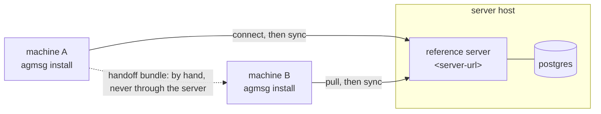

# Remote setup

*[日本語](remote-setup.ja.md)*

This walkthrough connects an existing team on machine A to the reference
server, then pulls it into a normal agmsg install on machine B. Your local
agents handle the client commands. This setup uses plaintext sync.
For encrypted sync, read
[Extra: end-to-end encryption](#extra-end-to-end-encryption).

## What you are about to do

| Where | What |
|---|---|
| **Server host** | Start the reference server — step 1 |
| **Machine A** | Connect the team you already have — step 2 |
| **Machine B** | Install agmsg, pull the team, join it — steps 3 and 4 |
| **Finished when** | A message sent on one machine arrives on the other — step 5 |

The machines do not need a direct connection to each other for sync: both reach
the same server URL. That URL is the only network endpoint they share. On the
encrypted path they also agree on the key bundle and its digest — handed over
and checked outside this connection, not through the server.



The dotted line is only for the encrypted path, and it is dotted for a reason:
the key bundle is carried between the machines by you. If it went through the
server, the server could read the messages.

## Requirements

- Docker with Compose — or PostgreSQL 17, if you bring your own database.
  If you use the Compose path, confirm it before starting:
  `docker compose version` should print a version, not an error. On the
  setup this was reported from, a missing Compose plugin surfaced only as
  `docker compose up -d --build` failing with `unknown shorthand flag: 'd'
  in -d` — an error that never mentioned "compose" — so this is worth
  checking up front rather than debugging later.
- Node.js 22 or later
- Bash, SQLite, and curl
- An agmsg checkout on the server host
- A server URL that both machines can reach

Use HTTPS when the server is not on localhost.

## 1. Start the reference server

The Compose stack brings up PostgreSQL and the server together. Run it from the
`server` directory:

```sh
cd server
docker compose up -d --build
```

Nothing to fill in: the database name, user and password are in
`server/compose.yaml`. They are development defaults — read
[Network boundary](#network-boundary) before this server is reachable by
anyone else.

Confirm the server and database are ready. On the machine running Compose:

```sh
curl -fsS http://127.0.0.1:8787/v1/health
```

The response should contain `"status":"ok"` and `"database":"ok"`. If the
containers are still starting, retry until it succeeds.

**That address is the endpoint** for every command below — write
`http://127.0.0.1:8787` wherever this document says `<server-url>`, as long as
both machines can reach it. Two accounts on one host can; so can two machines on
a network you control, using the host's address rather than `127.0.0.1`.

The address is not permanent: a connected team can be moved to a new address of
the **same** server later — a port-forward replaced by the LAN address, a tunnel
replaced by a stable name — with `remote.sh set-endpoint --endpoint <new-url>
<team>`. It verifies the new address answers as the same server instance before
anything changes, and refuses (naming both ids) when it does not. Only the
address can move this way; pointing a team at a *different* server is
deliberately not possible without disconnecting first.

Only when the second machine reaches the server over a network you do not
control does it need a public HTTPS URL. Then check it from there too:

```sh
curl -fsS https://<server-url>/v1/health
```

This server belongs on a network you control: it has no authentication, so
reaching it is the permission. Before it is reachable by anyone else, read
[Network boundary](#network-boundary).

Already running PostgreSQL? See [Using your own database
instead](#using-your-own-database-instead).

## 2. Connect the existing team on machine A

Open your usual local agent on machine A and ask:

> Connect my existing agmsg team `<team>` to `https://<server-url>`.

The agent will connect the local team and report the result. It will finish by
showing a copy-paste `remote.sh pull` command with your server URL and team
name already filled in.

Connect moves this team from the shared database into a per-team store. If an
external tool reads the database file directly, resolve the team's new path
instead of continuing to use the shared database path. Ask the agent for the
team's store path, or use the command in [Reference](#reference).

**If you connected with `--e2ee`, export the handoff bundle now**, while you are
still on the machine that holds the key:

```sh
bash ~/.agents/skills/agmsg/scripts/key.sh handoff <team> --out <bundle-file>
```

It prints a snapshot digest. Keep it — machine B has to be given it separately
from the bundle, and comparing the two is the check.

Do this here rather than later. Machine B's `pull` will tell you the team is
locked and to unlock it "with the bundle you were given", as though one exists;
nothing on either machine says to create it. Details of what the bundle is and
how to carry it are in
[Extra: end-to-end encryption](#extra-end-to-end-encryption).

## 3. Install and pull on machine B

Install agmsg normally on machine B. Open your usual local agent and ask:

> Bring in the existing agmsg team `<team>` from `https://<server-url>`.

The agent will use remote pull to import the team that already exists on the
server. It must not create or join a same-named local team. If it finds an
unconnected local team with that name, it will stop and ask you how to proceed
instead of overwriting or combining the two teams.

After pull succeeds, the team exists on machine B. That is not the same as
machine B being *in* it — the team arrived with machine A's roster, and the
agents here still have no name in it. One more step, below.

If this team is encrypted, `pull` stops and reports the team as locked. Go to
[Extra: end-to-end encryption](#extra-end-to-end-encryption), unlock it, and
come back here.

## 4. Join from machine B

In the agent you want to put in the team, invoke the install's own command
**with no arguments**:

```text
/agmsg
```

`npx agmsg` installs as `agmsg`, so `/agmsg` is the one to type. The command is
named after the install, so if you gave `install.sh` a `--cmd` of your own, use
that name instead — see [Use a separate install for
testing](#use-a-separate-install-for-testing).

Bare, with nothing after it, the command notices this agent belongs to no team
yet and lists the teams it can see — the pulled one among them. Choose it. The
team already exists, so it reads the roster, sees which names machine A is
already using, and offers unused ones that follow the same convention. Then it
asks for a [delivery mode](../README.md#delivery-modes).

**Take a new name.** A name is one identity in one team; two machines answering
to the same one is what this step exists to prevent. The suggestions are
generated against the live roster, so any of them is safe.

Nothing here is remote-specific — it is the ordinary first-run join, and after
it the team behaves like any other local team.

## 5. Send and verify

On machine A, ask your local agent:

> Send `hello from machine A` from `<from>` to `<to>` in team `<team>`.

Connect and pull already started the sync engines. Wait a few seconds, then
use the [history command](#client-commands-send-and-verify) on machine B.

The history should contain:

```text
<from> → <to>: hello from machine A
```

## Extra: end-to-end encryption

The remote team's encryption choice is fixed by its first connect and cannot
be changed later. If you need an encrypted team, connect it with `--e2ee`:

```sh
bash ~/.agents/skills/agmsg/scripts/remote.sh connect \
  --endpoint https://<server-url> \
  --e2ee \
  <team>
```

If the team has no key yet, connect creates one and prints the mandatory backup
notice. On machine A, export one secret handoff bundle containing the confirmed
snapshot chain and every epoch identity:

```sh
bash ~/.agents/skills/agmsg/scripts/key.sh handoff <team> --out <bundle-file>
```

Transfer that bundle to machine B through a separate trusted channel. The
message server never distributes key material. Compare the displayed snapshot
digest over a separate live channel. After `pull` reports that the team is
locked, machine B runs:

```sh
bash ~/.agents/skills/agmsg/scripts/remote.sh unlock <team> \
  --bundle <bundle-file> \
  --confirm-digest <verified-sha256>
```

`unlock` imports the identity, records the trust anchor, reprocesses quarantined
envelopes, and starts the encrypted sync engine. It is safe to repeat with the
same confirmed bundle. The bundle contains private keys: keep it secret and
delete the transferred copy when it is no longer needed.

Unlock finishes the key work, not the membership. Machine B still has no name in
the team, so return to [4. Join from machine B](#4-join-from-machine-b) and
carry on from there.

### Verifying a team's encryption state

Local behavior looks identical either way — `history`, `inbox`, and `send`
read and write exactly the same regardless of whether a team is encrypted.
**A readable local message history is not evidence that a team is
unencrypted.** Only the server side differs: an encrypted team's server rows
carry `cipher: age-v1` and hold sealed ciphertext, so `from`, `to`, and `body`
are not readable there.

To find out whether a given team is e2ee, ask the program rather than
inferring it from what you can read:

```sh
bash ~/.agents/skills/agmsg/scripts/remote.sh status <team>
```

For a connected team, the output includes an `encryption:` line reflecting
the binding's declared cipher, the server's write policy, and whether a
local key is present — possible values include `age-v1, ...`, `none` (in
either of its forms), or `required, no local key`. Read the line itself
rather than assuming a two-way encrypted / not-encrypted split. A
disconnected team's status has no `encryption:` line at all; reconnect
first.

## Reference

### Network boundary

The reference profile has no authentication: reaching the server is the
permission. Anyone who can reach it and name a team can read that team's
remote stream. Keep it on a network you control, and use HTTPS for anything
leaving localhost. Encrypting with `age-v1`
([above](#extra-end-to-end-encryption)) keeps envelope contents from the
server; it does not replace the boundary.

The Compose stack publishes its port and ships a development password in
`compose.yaml`. Change that password and terminate TLS in front of the service
before this reaches a network you do not control — see
[`server/README.md` → Compose configuration](../server/README.md#compose-configuration).

### Terminating TLS with a private CA

If the reverse proxy in front of the server carries a certificate from a CA
that is not publicly trusted (a self-signed cert, or a CA of your own),
point every `remote.sh` invocation at it with `CURL_CA_BUNDLE=<path-to-ca.pem>`.
`connect`'s own request goes through curl, which reads that variable
directly; the persistent sync engine, `pull`'s team lookup, and pull's own
message-page fetching are all Node processes started through
`remote-sync.sh`, which passes the same `CURL_CA_BUNDLE` value on to Node
as `NODE_EXTRA_CA_CERTS` when Node's own variable is not already set.
Setting `CURL_CA_BUNDLE` is enough for all of these; set
`NODE_EXTRA_CA_CERTS` yourself only if Node needs to trust something curl
does not.

This is per-invocation, not remembered by the team's remote binding:
`CURL_CA_BUNDLE` needs to be set in whatever shell runs `remote.sh`,
including a later `remote.sh sync start <team>` after the engine crashes or
the machine reboots — not only the shell that ran the original `connect`.

### Using your own database instead

If you already run PostgreSQL, start the server from source against it. The
commands live in [`server/README.md` → Run from
source](../server/README.md#run-from-source), which is the one place they are
written down.

Either way the server applies its own migrations at startup, so there is no
schema step to run first.

### Install on machine B

Use the standard installation entry point:

```sh
npx agmsg
```

### Connect machine A

```sh
bash ~/.agents/skills/agmsg/scripts/remote.sh connect \
  --endpoint https://<server-url> \
  <team>
```

### Resolve the team store

```sh
bash ~/.agents/skills/agmsg/scripts/api.sh get teams <team> store
```

### Pull on machine B

```sh
bash ~/.agents/skills/agmsg/scripts/remote.sh pull \
  --endpoint https://<server-url> \
  <team>
```

### Client commands: send and verify

```sh
bash ~/.agents/skills/agmsg/scripts/send.sh \
  <team> <from> <to> "hello from machine A"

bash ~/.agents/skills/agmsg/scripts/history.sh <team> <to>
```

### Use a separate install for testing

To keep a test separate from an existing install, clone the repository and run
this from the checkout root:

```sh
bash install.sh --cmd agmsg-test
```

That install's commands are under `~/.agents/skills/agmsg-test/scripts/`.

For the single-machine, two-install rehearsal, see
[Try it on one machine](design/remote-sync.md#try-it-on-one-machine).

**Separate the install, not just the environment.** It is tempting to fake a
second machine with `AGMSG_SYNC_CONNECTION_DIR`, `AGMSG_STORAGE_PATH` and
friends, pointed at one install. That separates less than it looks like it
does, and the part it misses fails quietly:

- Five files under `scripts/` read `AGMSG_SYNC_CONNECTION_DIR`: `remote.sh`,
  `remote-sync.sh`, `key.sh`, `internal/migrate-team-store.sh` and
  `internal/remote-sync.mjs`. Connection state does move.
- `send.sh`, `history.sh`, `team.sh` and `inbox.sh` do not. They resolve the
  team config from the install directory — `team.sh` reads
  `$SCRIPT_DIR/../teams/$TEAM/config.json` — so both "machines" share it.

The result is a second machine that writes into its own store and can read its
own history, while the config the sync engine works from belongs to the first
one. Symptoms seen: `team.sh` answering `Team not found`, the roster driver
failing on a path under the first install, and a sync engine reporting
`push.prepared count:0` forever while local sends land in the local store.

A real second machine is a separate install, so test one that way: run
`install.sh --cmd agmsg-test` (or copy the checkout) and give each machine its
own directory. #610 fixed one instance of this — the roster driver was not
handed its file — but it was one instance, not the class.

### Back up before connecting

If you want a rollback copy, do this before step 2:

Here `<storage>` is the install root, normally `~/.agents/skills/agmsg`.

1. Back up `<storage>/db/messages.db` and the entire `<storage>/teams/` directory.
2. To restore, run `bash <storage>/scripts/delivery.sh stop`, then
   `bash <storage>/scripts/remote.sh disconnect <team>`.
3. Copy both backups back to their original paths.
4. Delete `<storage>/db/teams/<team>/`, then restart your normal delivery mode.
