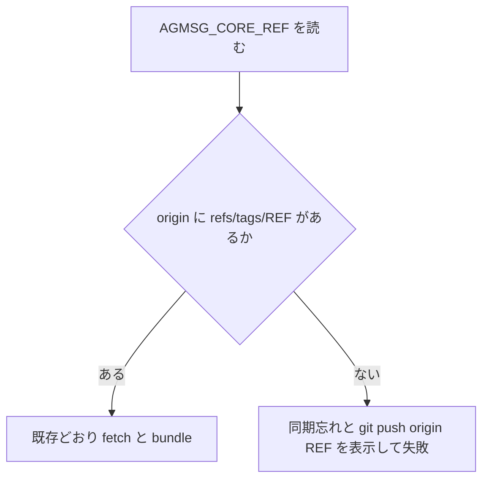

# Issue #15: agmsg-core タグ同期忘れの診断

## 目的

`app/AGMSG_CORE_REF` が指定するタグを `origin` に同期し忘れたとき、
`bundle-core.sh` が fetch の Git 内部エラーではなく、フォークへタグを push する操作を示して停止する。

## 決定済みの運用

- 固定参照はタグのままとする。
- リリース担当者は公式の読み取り元からタグを取得し、`kappaseijin/agmsg` の `origin` へ同期する。
- CI・ローカルビルドとも、同期済みの `origin` だけを参照する。ビルド時に第三者リポジトリへアクセスしない。

## 検討した方法

| 方法 | 判断 | 理由 |
| --- | --- | --- |
| `origin` のタグを事前照合して明示診断する | 採用 | 実行場所を問わず原因と復旧操作を示せる。|
| `git fetch` の失敗後に診断を追加する | 不採用 | タグ不在と認証・通信などを区別できず、元の Git エラーも主な診断として残る。|
| CI workflow だけでタグを検査する | 不採用 | `build-notarize.sh` と release workflow の呼び出しでは同じ問題が分かりにくいまま残る。|

## 振る舞い

`bundle-core.sh` は `AGMSG_CORE_REF` を読み取った後、`origin` に
`refs/tags/<REF>` があるかを照合する。

- タグがある場合: 現在どおり fetch、archive、必須パス検査を実行する。
- タグがない場合: 非 0 で終了し、`AGMSG_CORE_REF` が指すタグが `origin` に無いこと、および `git push origin <REF>` でフォークへ公開してから再実行することを stderr に出す。

## テスト

新しい Bats テストは、タグを持たないローカル bare repository を `origin` として実行する。
期待する失敗診断に「origin に固定タグが無い」と「`git push origin <REF>`」が含まれることを検査する。
この fixture が、受け入れ条件の「在ると分かっているタグを取り除いた状態」を再現する負のコントロールになる。

加えて、存在しない remote URL は tag 不在と誤診せず、同期の push 操作を出さないことを検査する。
これは `exit 2` を任意の非 0 に変える変異を殺す。fixture に有効な core tag を公開した場合は
bundle が完走することも検査し、tag が存在しても常に拒否する変異を殺す。

## 利用者向け文書

`app/README.md` のリリース手順は、`AGMSG_CORE_REF` を変更した後にそのタグを
ビルド対象フォークの `origin` へ同期する必要があることを示す。これにより、
README だけで pin の更新と CI 実行に必要な操作を完結させる。

## 範囲外

- タグを自動取得・自動 push すること。
- `AGMSG_CORE_REF` をコミット SHA へ変更すること。
- CI の app ジョブ条件を緩めて失敗を隠すこと。
