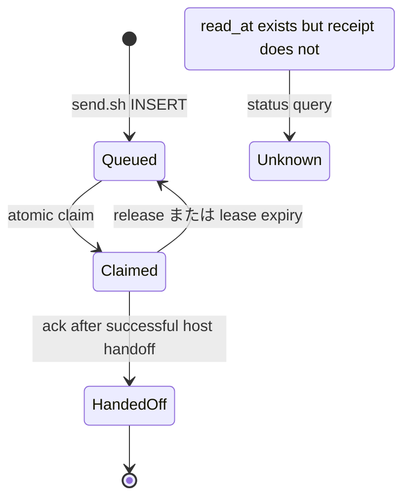

# Issue #37 Message Claim/Ack Design

## 目的

Issue #18 の「`Sent to ...` が席の受信・処理成功に見える」問題を、`kappaseijin/agmsg` 内だけで解決する。upstream [Issue #373](https://github.com/fujibee/agmsg/issues/373) と [PR #372](https://github.com/fujibee/agmsg/pull/372) は設計入力として参照するが、upstream を待たず、履歴も取り込まない。

送信成功、receiver が message を reservation したこと、receiver が host へ引き渡したことを別々に保存する。LLM が業務タスクを理解・完了したことはこの protocol では表さない。

## 状態と保存先



`messages` は既存の本文・宛先・`read_at` を維持する。新規状態は次の 2 table で表す。

| Table | Key | Meaning |
|---|---|---|
| `message_claims` | `message_id` | 未読 message を一つの receiver owner に lease する。`owner`、`claimed_at`、`expires_at` を持つ。 |
| `message_receipts` | `message_id` | protocol handoff を完了した immutable receipt。`owner`、`handed_off_at`、`evidence` を持つ。 |

`ack` は同じ transaction で、所有者と未期限 lease を検査し、receipt を作成し、`messages.read_at` を更新して claim を削除する。既存の `read_at` は互換 marker としてだけ残し、receipt が無い旧 row は `unknown` と表示する。これにより既存の `○` を「エージェントが読んだ」と誤読しない。

## API

`scripts/lib/claims.sh` は Shell library として次を提供する。

```bash
agmsg_claim_next <team> <agent> <owner> [ttl_seconds]
agmsg_claim_id <message_id> <owner> [ttl_seconds]
agmsg_ack_claim <message_id> <owner> [evidence]
agmsg_release_claim <message_id> <owner>
agmsg_receipt_status <team> <agent>
```

`agmsg_claim_next` の stdout は既存 inbox と同じ unit separator 形式、`id US from_agent US escaped_body US created_at` とする。空 output は claim 可能な row が無いことを表し、exit 0 とする。`ack` と `release` は owner 不一致または期限切れで non-zero にする。

Node の Codex bridge が library を source できるよう、`scripts/claim.sh` はこの API の thin CLI とする。

```text
claim.sh next <team> <agent> <owner> [ttl_seconds]
claim.sh claim <message_id> <owner> [ttl_seconds]
claim.sh ack <message_id> <owner> [evidence]
claim.sh release <message_id> <owner>
```

manager 向けには `scripts/message-status.sh <team> <agent> [--format json]` を追加する。JSON は `schemaVersion`、`queued`、`claimed`、`handedOff`、`unknown`、`oldestQueuedAt`、`ackSemantics` を返す。

`unknown` は legacy `read_at` または観測できない host handoff を意味する。未起動の Codex と正常な turn 間の Codex はいずれも queued のままであり、本 Issue は両者を liveness から推測しない。type/project ごとの live capability JSON は #39 の担当に残す。

## Adapter の規則

すべての receiver は次の順序を守る。

1. message を claim する。
2. host へ message を出力または `turn/start` input に入れる。
3. host handoff が成功した場合だけ ack する。
4. handoff に失敗した場合は release する。プロセス crash なら TTL expiry 後に再取得できる。

対象 adapter は `inbox.sh`、`check-inbox.sh`、`watch.sh`、Codex bridge の `--inline-inbox` 経路である。通常の Codex bridge wake prompt は本文を host input に渡さないため ack しない。これにより「turn を起こした」ことを「message を読ませた」こととして記録しない。

`watch.sh` は既存の watermark を維持し、DB row を先に列挙した後は `agmsg_claim_id` でその row を reservation する。stdout write が失敗した場合は claim を release し watermark を進めずに終了する。既存の broad watcher と exclusive watcher の ownership guard も維持する。

## 表示と互換性

- `send.sh` は insert 後に message id を取得し、`Queued message <id> ...; delivery not yet acknowledged.` と表示する。
- `history.sh` は `●` を queued、`○` を protocol handoff acknowledged、`?` を legacy/unknown と表示し、legend を出す。
- `message-status.sh` は handoff ACK が業務タスク完了ではないことを明記する。
- 既存の人間向け `inbox.sh` と `check-inbox.sh` の本文形式は保つ。

## 非対象

- herdr pane の trust prompt、composer、Return/Enter を操作すること。
- agent が業務を理解・実施・完了したことの推定。
- automatic spawn、work item lease、GitHub Issue/PR mutation。
- `fujibee/agmsg` への write、upstream PR #372 の merge 待ち、Git history の取り込み。

## 検証

1. Bats fixture で claim exclusion、release/reclaim、wrong-owner rejection、TTL reclaim、escaped body を確認する。
2. `send.sh` の output が queued と message id を示し、receiver ACK 前に成功を装わないことを確認する。
3. `inbox.sh`、`check-inbox.sh`、`watch.sh` の successful handoff が receipt を作り、failure/release が unread row を残すことを確認する。
4. fake app-server を使い、Codex bridge の inline inbox は `turn/start` ACK 後に receipt を作り、通常 wake prompt は message receipt を作らないことを確認する。
5. full `bats tests`、`node --check scripts/drivers/types/codex/codex-bridge.js`、`git diff --check` を実行する。

## Self-review

- upstream の採用範囲、ローカル実装、非対象を分離した。
- receipt の意味を transport handoff に限定し、LLM の業務完了と混同しない。
- legacy `read_at` と liveness 未観測を false success にしない。
- #39、#41 以降の delivery capability / work item lease と責務を重複させない。
