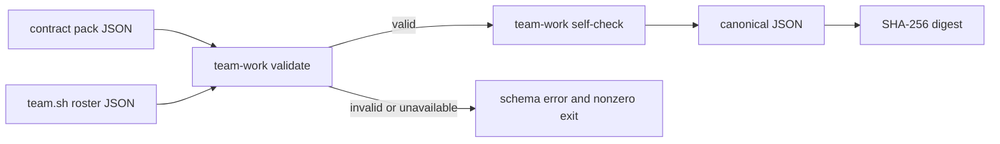

# Team-work contract pack validation design

## Purpose

Issue #40 は、後続の lease mutation（#41）や GitHub live audit（#42）より前に、
work item の静的契約を fail-closed で検証できるようにする。
この slice は外部 API、メッセージ送信、state file の更新を行わない。

## Boundary

入力は project の contract pack と、既存 `team.sh --format json` が返す versioned roster contract である。
contract pack は source/PR relation、owner seat、work kind、revision、classification basis、writeback 要件を表す。
roster は owner が実在する `seat` であることの唯一の照合元にする。



## Command contract

```text
scripts/team-work.sh validate <team> <contract-pack.json>
scripts/team-work.sh self-check <team> <contract-pack.json>
```

Both commands read only their arguments and the selected team's existing config.
They obtain the roster through `team.sh <team> --format json`, so the same #38
contract validator is used in production and tests.

`validate` prints one compact JSON result on stdout when valid:

```json
{"schemaVersion":1,"valid":true,"team":"example","workItemCount":1}
```

`self-check` first performs the same validation, then emits a compact canonical
result containing the pack digest and each envelope digest. It does not write
the computed digests back into the pack. A schema failure prints a stable
`schema error:` diagnostic to stderr and exits with status 2.

## Contract pack schema v1

```json
{
  "schemaVersion": 1,
  "team": "example",
  "workItems": [
    {
      "schemaVersion": 1,
      "workItem": {
        "id": "issue:40",
        "source": {"kind": "issue", "repository": "kappaseijin/agmsg", "number": 40}
      },
      "ownerSeat": "example_programmer_codex",
      "workKinds": ["implementation"],
      "relations": [
        {
          "kind": "pull_request",
          "repository": "kappaseijin/agmsg",
          "number": 46,
          "relation": "contributes"
        }
      ],
      "revision": 1,
      "classificationBasis": {
        "contentDigest": "sha256:0123456789abcdef0123456789abcdef0123456789abcdef0123456789abcdef",
        "refs": [{"kind": "issue", "repository": "kappaseijin/agmsg", "number": 40}]
      },
      "writebackRequired": false
    }
  ]
}
```

`workKinds` is a non-empty, duplicate-free subset of `implementation`,
`writeback`, `inventory`, `closeout`, and `reconciliation`.
`ownerSeat` must name a roster member whose `kind` is exactly `seat`; human and
service identities are deliberately rejected.

A `pull_request` relation is either `contributes` or `closes`.
For `closes`, `closingIssue` is required and must exactly equal the work
item's issue source (`repository` and positive `number`). This static check
prevents a closing relation that later cannot be verified by #42's live audit.

`classificationBasis` requires a SHA-256 formatted content digest and at least
one immutable issue, pull-request, commit, or evidence reference.
`revision` is a positive integer. `writebackRequired` is a boolean.

## Canonical form and digest

The command uses only Node.js standard-library JSON parsing and SHA-256.
It recursively sorts object keys with binary code-unit ordering and preserves
array order, serializes with `JSON.stringify`, then prefixes the lowercase hex
digest with `sha256:`. Whitespace and object-key input order therefore do not
affect a digest. Arrays remain ordered because #40 does not define set
normalization; producers must provide a stable order for semantically ordered
arrays.

The digest of an individual envelope omits an optional `envelopeDigest` field.
The pack digest is over the validated pack with no mutation or generated fields.
This gives #41 a stable input for append-only revisions without assigning #40
ownership of persistence.

## Error and safety policy

The validator rejects malformed JSON, unknown schema versions, duplicate work
item IDs, missing required fields, invalid source/ref variants, non-seat or
missing owners, unknown/duplicate work kinds, malformed basis digests, and
incomplete closing relations. It never guesses an owner from a name pattern,
never calls GitHub, and never treats absent evidence as a successful empty
contract.

If the team is missing or its roster JSON contract fails, the command reports
that failure and returns nonzero rather than validating against a partial
legacy config.

## Verification

`tests/test_team_work.bats` will cover:

1. a valid pack through `validate` and `self-check`;
2. equal digest for equivalent key order and whitespace variants;
3. old schema, missing owner, human/service owner, unknown work kind, and
   incomplete `closes` relation;
4. malformed basis, revision, and duplicate work-item cases; and
5. read-only behavior by asserting no contract, roster, or state file changes.

## Out of scope

The following stay in their assigned child issues: work ownership mutation and
lease (#41), GitHub pagination/audit and queue classification (#42), and
reconciler/watchdog/dispatch (#43).
