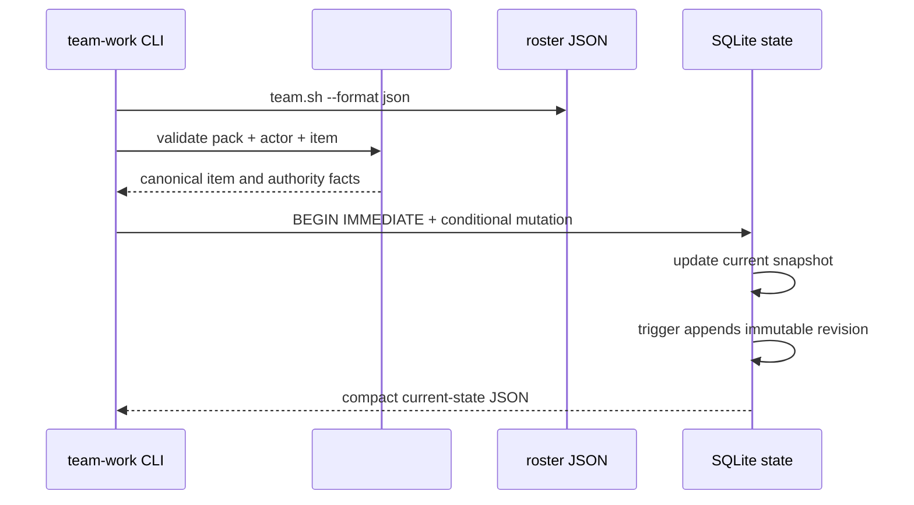

# Team-work work-item lease and revision-chain design

## Purpose

Issue #41 adds the mutable G2 layer after #40's read-only contract validation.
It owns a work item lease and its append-only revision chain. It does not share
the receiver-message claim tables from #37, and it does not call GitHub,
classify a queue, or dispatch an agent.

## Boundary and authority

Every mutation receives the same validated contract pack that #40 accepts.
The selected item supplies its exact `ownerSeat`, source, and immutable
`envelopeDigest`. The roster from `team.sh --format json` is the only authority
source:

- the declared owner seat may claim its own item;
- a member whose exact `kind` is `seat` and exact `role` is `manager` may claim
  any item;
- after a claim, only the unexpired lease holder may acknowledge, renew,
  release, change state, link a PR, or record writeback evidence.

Manager authority is never inferred from an agent name. A manager who needs to
intervene in a live lease must wait for expiry or acquire an unleased item, so a
second manager cannot rewrite an active owner's history.



## Public command contract

The existing read-only commands keep their three-argument form. Mutating
commands use this shape:

```text
team-work.sh claim     <team> <contract-pack.json> <work-item-id> <actor-seat> [ttl-seconds]
team-work.sh ack       <team> <contract-pack.json> <work-item-id> <actor-seat> [evidence]
team-work.sh renew     <team> <contract-pack.json> <work-item-id> <actor-seat> [ttl-seconds]
team-work.sh release   <team> <contract-pack.json> <work-item-id> <actor-seat>
team-work.sh set-state <team> <contract-pack.json> <work-item-id> <actor-seat> <state>
team-work.sh link-pr   <team> <contract-pack.json> <work-item-id> <actor-seat> <repository> <number> <contributes|closes>
team-work.sh writeback <team> <contract-pack.json> <work-item-id> <actor-seat> <evidence>
```

`ttl-seconds` is a non-negative integer and defaults to 300 seconds; `0` is
valid only to make expiry/reclaim fixtures deterministic. `ack` defaults its
evidence to `owner_ack`. Accepted explicit states are `acknowledged`,
`in_progress`, `blocked`, and `completed`; a successful claim creates state
`claimed`. `release` clears only the lease and preserves the current work
state.

Success prints one compact JSON object with `schemaVersion`, `team`,
`workItemId`, `revision`, `state`, `leaseOwner`, `leaseExpiresAt`,
`envelopeDigest`, and `lastAction`. A rejected operation exits 2 with a stable
`schema error:` diagnostic and never changes current state or audit history.
Usage/runtime errors exit nonzero without interpreting absent state as success.

## Persistence model

The existing `messages.db` remains the local durable store, but #41 uses its
own tables rather than `message_claims` or `message_receipts`.

| Table | Responsibility |
| --- | --- |
| `team_work_current` | One latest mutable snapshot per `(team, work_item_id)`. |
| `team_work_revisions` | Immutable resulting snapshot for each revision. |

`team_work_current` stores the contract/envelope digests, declared owner,
source, revision, state, lease fields, PR links, writeback evidence, and last
action/actor. Its primary key prevents two latest rows for one work item.
`team_work_revisions` has primary key `(team, work_item_id, revision)` and
stores both the prior revision (or null for the first claim) and the resulting
snapshot JSON.

An `AFTER INSERT` and an `AFTER UPDATE` trigger append the history row inside
the same SQLite transaction that changed `team_work_current`. The command never
updates or deletes a history row. Therefore every visible latest revision has
exactly one matching audit row, and failed conditional updates leave both tables
unchanged.

## Lease and mutation semantics

All database writes use `BEGIN IMMEDIATE`. A `claim` inserts the first current
snapshot at the contract item's initial positive `revision`, or conditionally
replaces an absent/expired lease while incrementing revision. Two simultaneous
different claims race on the same transaction; only one conditional write can
change a row.

`renew`, `ack`, `release`, `set-state`, `link-pr`, and `writeback` require the
actor to equal the active lease owner and require `lease_expires_at` to be
strictly later than the SQLite clock. An expired lease cannot be renewed or
released; an authorized owner or manager instead reclaims it with `claim`.

The command refuses contract drift: every existing state row must have the same
contract digest and item envelope digest as the supplied pack. `link-pr`
records only local evidence. It accepts one unique relation, requires a
positive PR number, and permits `closes` only when the work item's source is an
issue in the same repository. `writeback` appends local evidence only; it does
not post to GitHub.

## Implementation approach

`scripts/team-work.sh` remains Bash 3.2-compatible. It fetches roster JSON and
initializes the database only for mutation commands. `scripts/lib/team-work.js`
continues to own contract parsing, canonical digests, and exact authorization.
For a mutation it invokes the installed `sqlite3` command with a generated,
fully quoted transaction; no npm package or Node database binding is added.

Input values are type-checked before SQL generation. String values are SQL
literal-quoted by doubling single quotes; numeric values are accepted only when
they satisfy a positive/non-negative integer check. This preserves the existing
SQLite CLI portability on macOS, Linux, and Git Bash.

## Verification

`tests/test_team_work_state.bats` will prove:

1. a declared seat can claim and receives the initial revision;
2. concurrent claims by different authorized seats produce exactly one winner;
3. a non-holder cannot ack, renew, or release and cannot change revision or
   history;
4. expiry permits safe reclaim and leaves a contiguous append-only chain;
5. manager authority depends on explicit roster `kind` and `role`, not a name;
6. `set-state`, `link-pr`, and `writeback` append result snapshots; and
7. local mutations never alter the contract pack, team config, messages, or
   receiver claim/receipt tables.

The established #40 and roster tests remain part of the regression command.

## Out of scope

GitHub live audit and queue classification remain #42. Reconciliation,
watchdog polling, receiver boot checks, and automatic dispatch remain #43.
Message transport ownership stays in #37 / Issue #18.
