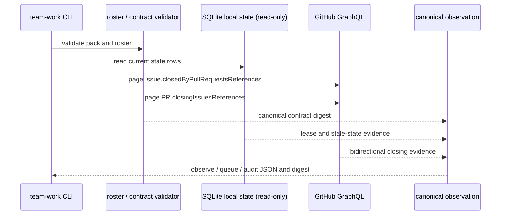

# Team-work GitHub live audit and queue classification design

## Purpose

Issue #42 adds the read-only G2 observation layer after the #40 contract
validator and #41 local lease store.  It determines whether a packed work item
is ready from live GitHub Issue / PR information and the local work-state row.
It never changes GitHub, a lease, a message, or an agent process.

## Boundary

The contract pack is the work universe for this command.  The audit does not
inventory arbitrary repository Issues or create missing contract items.  Each
packed source Issue is fetched directly, and every PR relation declared in the
pack, stored by `link-pr`, or returned as an Issue-side closing relation is
checked.

The local `team_work_current` row is read with SQLite read-only mode.  An
absent row means the item is unleased; an existing row with different contract
or envelope digest, source, or owner is stale.  A missing/unreadable local
store is an unavailable source, not proof that no work is ready.



## Public command contract

```text
team-work.sh observe <team> <contract-pack.json>
team-work.sh queue   <team> <contract-pack.json>
team-work.sh audit   <team> <contract-pack.json>
```

All three commands validate the pack and roster exactly as `validate` does,
then perform only GitHub GraphQL queries and SQLite reads.  A malformed pack,
unavailable roster, invalid CLI form, or missing Node runtime remains a normal
nonzero command error.  A live-source problem is represented by a successful
canonical observation whose `classificationBasis.status` is `"unknown"`; that
allows a later reconciler to consume the evidence while fail-closing dispatch.

`observe` emits the per-item observed state, `queue` emits only ready items,
and `audit` additionally emits relation checks and violations.  All share the
same classification basis and source digest for one invocation.

## GitHub evidence and pagination

The implementation invokes only `gh api graphql` with named, explicit
GraphQL `query` operations.  It uses these two independently paginated
connections:

1. `Issue.closedByPullRequestsReferences` for every packed source Issue;
2. `PullRequest.closingIssuesReferences` for every related PR.

Each connection starts at `after: null` and continues until
`pageInfo.hasNextPage` is false.  The audit records a source-unavailable
violation if a response has GraphQL errors, lacks a connection/page-info field,
repeats a cursor, claims a next page without a cursor, returns duplicate nodes,
or has a final node count different from `totalCount`.  Therefore a partial
page can never be mistaken for an empty relation.

For a source item, expected PR relations are the union of immutable pack
relations and the local `pr_links_json` relations.  For every expected
`closes` relation, the same PR must occur on both sides of the GitHub relation.
For `contributes`, the PR must not close the source Issue.  An Issue-side
closing PR omitted from expected relations, a relation found only on one side,
or contradictory local/packed relation kinds creates an incomplete-relation
violation.  The project status is then `unknown`.

The normal `gh` owner guard continues to reject all writes.  It gains only a
conservative read classification for `gh api graphql` calls that have exactly
one field named `query`, no explicit method/input body, an explicit document
beginning with `query`, and no `mutation` or `subscription` token.  All other
parameterized API calls remain rejected.  This makes the GraphQL path usable
without creating a general POST exception.

## Classification

The canonical `classificationBasis` has these fields:

| Field | Meaning |
| --- | --- |
| `status` | `ready`, `fully_allocated`, `quiescent`, or `unknown`. |
| `readyCount` | Number of open packed source Issues without a live local lease. |
| `openItemCount` | Number of packed source Issues observed open. |
| `allocatedItemCount` | Number of open items with an unexpired matching local lease. |
| `closedItemCount` | Number of packed source Issues observed closed. |
| `reasons` | Stable, sorted violation or classification reason objects. |
| `sourceDigest` | SHA-256 digest of normalized GitHub and local evidence. |

Classification is deliberately conservative:

- any unavailable source, pagination defect, incomplete relation, or stale
  local row produces `unknown` and an empty queue;
- if a valid audit finds one or more unleased open packed Issues, it produces
  `ready` and puts those items in `queue.ready` in pack order;
- if `readyCount` is zero while at least one packed Issue is open and every
  such item has a valid, unexpired local lease, it produces `fully_allocated`;
- only if all packed source Issues are closed and their relations are complete
  does it produce `quiescent`.

An expired local lease is not an allocation.  A row whose envelope or contract
digest differs from the supplied pack is not reinterpreted as absent; it is
reported as stale and makes the whole result unknown.

## Canonical output

Every success path writes a single canonical JSON object (recursively sorted
object keys; arrays retain their documented order).  The shared fields are
`schemaVersion`, `command`, `team`, `contractDigest`, `items`,
`classificationBasis`, `sourceDigest`, and `auditDigest`.

`sourceDigest` hashes the normalized live and local evidence, excluding the
two digest fields themselves.  `auditDigest` hashes the complete result with
only `auditDigest` omitted.  This lets #43 compare observations without
depending on whitespace or object insertion order.  The full `audit` result
also contains stable `relationChecks` and `violations`; `queue` contains a
`ready` list and never returns a ready item while status is unknown.

## Verification

The Bats suite uses a PATH-injected fake `gh` process and JSON fixtures; no
test calls the network.  It proves all of the following through the public
CLI:

1. an Issue-side closing relation found only on a second page and its PR-side
   counterpart found only on a second page produce a complete quiescent audit;
2. an unleased open Issue is in `queue.ready`, whereas an unexpired matching
   lease produces `fully_allocated` with evidence;
3. a closed, complete packed source produces `quiescent` with evidence;
4. GraphQL failure, one-sided relation, and pack-vs-local digest drift each
   return `unknown` and an empty queue;
5. canonical output produces SHA-256 digests; and
6. the owner guard allows the explicit query form but still rejects a GraphQL
   mutation and ordinary parameterized REST API requests.

## Out of scope

This slice does not update a lease, write a GitHub Issue/PR, send a message,
spawn a role, poll continuously, or decide a remediation action.  #43 owns
reconciliation, watchdog timing, delivery-capability gates, ACK gating, and
remediation output.
