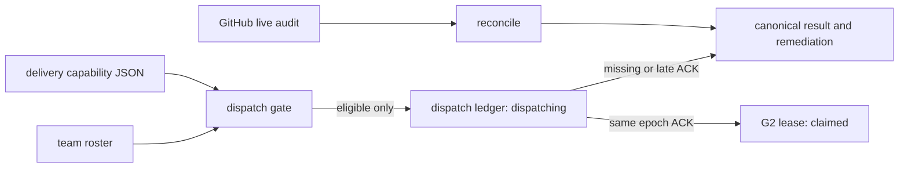

# team-work G3 reconciler・watchdog・dispatch gate 設計

## 目的

Issue #43 は、G2 の GitHub live audit と local work-item lease を消費して、
manager の対話状態に依存しない一回実行可能な reconciler を追加する。
reconciler は異常を検出して remediation を出力するだけで、GitHub、herdr、agent spawn、
message send を実行しない。

automatic dispatch の対象は、roster に存在する `kind: "seat"` のうち、
明示 allowlist にあり、`delivery.sh status … --format json` が
`deliverable: true` と示す既存 seat に限定する。
closed role を起動するコードは追加しない。

## 境界

既存の `team_work_current` は G2 の手動 claim/lease の正本として残す。
G3 の `dispatching` は新設の dispatch ledger にだけ記録し、
同じ epoch を owner seat が ACK した時点で G2 lease を `claimed` として作る。
これにより、`send.sh` が成功しても `claimed` にならず、G2 の既存 `claim` / `ack`
互換性も保つ。

`dispatch` は local ledger を更新する明示 command であり、外部へ送信しない。
実際にメッセージを渡す caller は、返却された epoch を owner に渡すだけでよい。
owner は `dispatch-ack` を通すまで作業を開始してはならない。

## command 契約

| Command | Local mutation | 目的 |
| --- | --- | --- |
| `reconcile <team> <pack> [heartbeat-path]` | 任意の heartbeat file の atomic replace のみ | live audit と local ledger から異常・remediation を返す。 |
| `watchdog <team> <pack> <heartbeat-path> [stale-seconds]` | なし | heartbeat の age を別 process から判定する。 |
| `dispatch <team> <pack> <work-item-id> <manager-seat> [ack-ttl]` | dispatch ledger | allowlist、seat、delivery、ready queue を再照合して `dispatching` を作る。 |
| `dispatch-ack <team> <pack> <work-item-id> <owner-seat> <lease-epoch> [evidence]` | dispatch ledger と G2 lease | 同一 epoch、owner、未期限切れ、live delivery を確認して `claimed` にする。 |

allowlist は `TEAM_WORK_DISPATCH_ALLOWLIST` の JSON string array とする。
未設定、JSON 不正、owner seat 不在は dispatch を fail-closed し、remediation を返す。
`delivery` が `false` または `"unknown"`、live registration が複数、あるいは
status command が失敗した seat も dispatch しない。

## dispatch ledger

`team_work_dispatch_current` は team/work item ごとの最新 dispatch state を持つ。
必要な field は contract/envelope digest、owner seat、`dispatching|claimed`、
lease epoch、lease expiry、queue digest、canonical delivery evidence、ACK evidence、
actor、作成/更新時刻である。
`team_work_dispatch_revisions` と SQLite trigger は immutable snapshot を追加する。

`dispatch` は G2 audit が `ready` と確認した item だけを ledger に insert する。
`dispatch-ack` は lease epoch、owner seat、expiry、delivery capability を確認し、
一つの SQLite transaction で dispatch ledger を `claimed` にし、G2 の
`team_work_current` lease を `claimed` にする。競合する live G2 lease があれば
transaction 全体を拒否する。

## reconciler と watchdog

reconciler は次を独立に検出する。

| Code | 条件 | remediation |
| --- | --- | --- |
| `expired_lease` | G2 または dispatch ledger の lease が期限切れ | owner の保全確認後に明示 reclaim/release を行う。 |
| `upstream_closed` | source Issue は closed だが active lease/dispatch が残る | 状態を自動変更せず、owner が closeout を確認する。 |
| `orphan_ready` | ready item の owner が live/allowlisted existing seat でない | seat を自動起動せず、manager が別 user gate または assignment を判断する。 |
| `writeback_required` | pack が writeback を要求し、local evidence がない | owner/manager が writeback evidence を記録する。 |
| `stale_state` | audit が local stale/source unavailable/relation incomplete を返す | source と local state を再照合する。 |

heartbeat は result の digest、cycle ID、開始/終了 epoch を持つ canonical JSON とする。
watchdog は heartbeat を読むだけで、reconciler と process、success flag、
launch mechanism を共有しない。欠落・不正・古い heartbeat は `unknown` / `stale` とし、
正常な quiescent result は alarm にしない。

## 安全性と非対象

- GitHub は G2 audit の GraphQL read だけを使い、Issue/PR mutation はしない。
- `send.sh`、`spawn.sh`、herdr CLI を呼ばない。closed role は `boot_required` / `orphan_ready` と出すだけである。
- unknown source、unknown capability、曖昧な live registration、allowlist 不備では dispatch しない。
- `dispatching` のみでは claimed にならない。期限後または epoch 不一致 ACK は reject する。
- heartbeat を除く `reconcile` / `watchdog` は SQLite、roster、pack、GitHub を変更しない。

## 検証

Bats fixture は fake `gh` と fake `delivery.sh` を使い、expired lease、upstream close、
orphan ready、writeback required、stale state、stale heartbeat、quiescent heartbeat を確認する。
dispatch test は non-allowlisted、unknown/stale delivery、closed role を拒否し、
成功時の `dispatching`、同 epoch ACK による `claimed`、ACK 無し/遅延 ACK の不遷移を確認する。
各 read-only command は SQLite hash と GitHub request log を比較して外部 mutation が無いことを検証する。
